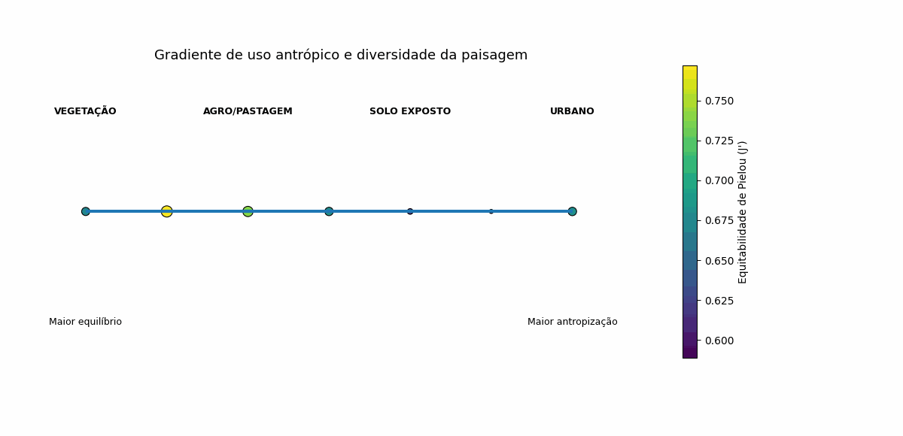

# Gradiente de Uso Antrópico e Diversidade da Paisagem

Visualização conceitual da relação entre **uso do solo** e **diversidade da paisagem** em municípios do sul de Minas Gerais.

---

## Sobre o Projeto

Este projeto gera um gráfico que representa um **gradiente de intensidade de uso antrópico**, posicionando municípios ao longo de um eixo que vai de áreas mais naturais até áreas mais antropizadas.

A proposta é evidenciar que:

> A diversidade da paisagem não depende apenas da quantidade de vegetação, mas também da distribuição das classes de uso do solo.

---

## Conceito do Gráfico

O eixo principal representa um gradiente interpretativo:

Cada município é posicionado nesse eixo com base na sua composição de uso do solo.

---

## Variáveis Representadas

- 📍 **Eixo X:** Gradiente de uso antrópico (conceitual)
- 🔵 **Tamanho dos pontos:** Índice de Shannon (H') *(normalizado)*
- 🎨 **Cor dos pontos:** Equitabilidade de Pielou (J')

---

## Dados

| Município         | Shannon (H') | Equitabilidade (J') |
|------------------|-------------|---------------------|
| Alfenas          | 1.243       | 0.772               |
| Itajubá          | 0.948       | 0.589               |
| Lavras           | 1.085       | 0.674               |
| Poços de Caldas  | 1.190       | 0.739               |
| Pouso Alegre     | 1.096       | 0.681               |
| Três Corações    | 0.991       | 0.616               |
| Varginha         | 1.095       | 0.680               |

---

## Como funciona

### 1. Definição do gradiente

Os municípios são ordenados manualmente com base na intensidade de uso antrópico:

```python
ordem_gradiente = {
    "Lavras": 1,
    "Alfenas": 2,
    "Poços de Caldas": 3,
    "Varginha": 4,
    "Três Corações": 5,
    "Itajubá": 6,
    "Pouso Alegre": 7
}
```

2. Normalização do índice de Shannon

Para melhorar a percepção visual do tamanho dos pontos, o índice de Shannon (H') foi normalizado entre 0 e 1.

**Fórmula utilizada:**
```python
(H - H_min) / (H_max - H_min)
```

---

### 3. Geração do gráfico

O gráfico é construído com a biblioteca `matplotlib` e apresenta os municípios distribuídos ao longo de um gradiente conceitual de uso antrópico.

O gráfico inclui:

- Linha base representando o gradiente de uso antrópico;
- Pontos representando cada município;
- Tamanho dos pontos proporcional ao índice de Shannon (H');
- Cor dos pontos representando a Equitabilidade de Pielou (J');
- Rótulos com o nome dos municípios;
- Valores de H' e J' abaixo de cada ponto;
- Barra de cores para interpretação da equitabilidade;
- Exportação da figura em alta resolução.

---

## Saída

O script gera automaticamente uma figura no formato PNG:

`figura_gradiente_antropizacao_diversidade.png`

A imagem é salva com resolução de 300 dpi.

---

## Interpretação

O gráfico permite visualizar a relação entre a intensidade de uso antrópico e a diversidade estrutural da paisagem.
Municípios posicionados mais à esquerda representam paisagens com maior equilíbrio entre classes de uso do solo, enquanto municípios mais à direita indicam maior predominância de usos antrópicos.
O tamanho dos pontos representa o índice de Shannon (H'), indicando a diversidade da paisagem. Pontos maiores indicam maior diversidade estrutural. A cor dos pontos representa a Equitabilidade de Pielou (J'), indicando o grau de equilíbrio na distribuição das classes. Valores mais altos indicam uma distribuição mais uniforme entre as classes de uso do solo. Dessa forma, o gráfico mostra que a diversidade da paisagem não depende apenas da presença de vegetação, mas também da forma como as diferentes classes de uso do solo estão distribuídas.

---
## ⚠️Limitações

O gradiente de uso antrópico utilizado no gráfico é conceitual e semi-quantitativo. A posição dos municípios no eixo não foi calculada a partir de um índice contínuo de antropização, mas definida com base na interpretação da composição das classes de uso do solo. Por isso, o gráfico deve ser interpretado como uma ferramenta visual complementar, e não como uma análise estatística definitiva.

---

## Possíveis melhorias

- Criar um índice quantitativo de antropização, considerando a proporção de classes como área urbana, solo exposto, agricultura e pastagem;
- Calcular automaticamente a posição dos municípios no gradiente a partir das porcentagens reais de uso do solo;
- Integrar os dados diretamente ao Google Earth Engine;
- Expandir a análise para diferentes anos, permitindo uma avaliação temporal da paisagem;
- Incluir outras métricas de ecologia da paisagem, como fragmentação, conectividade e dominância;
- Adaptar o gráfico para R, utilizando o pacote `ggplot2`.

---
# Gradiente de Uso Antrópico e Diversidade da Paisagem


